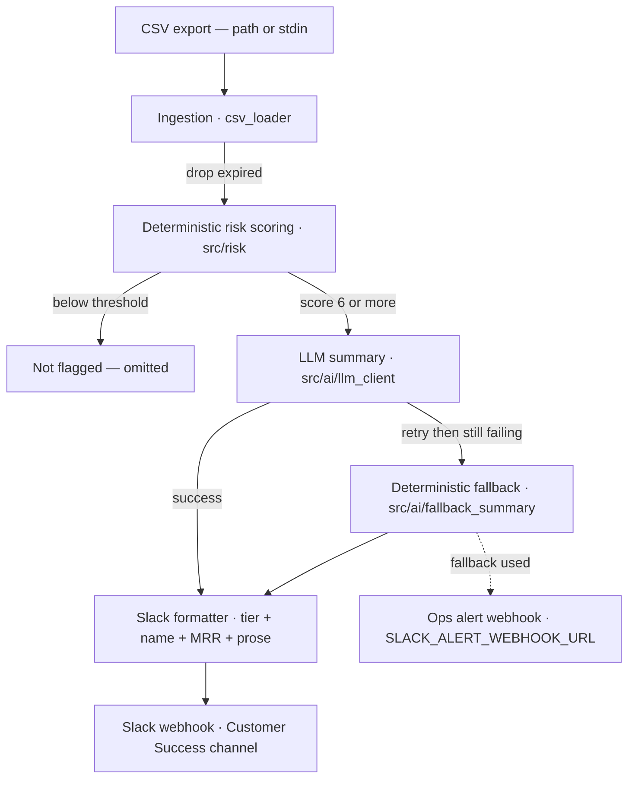

# System Flow

End-to-end flow of the weekly churn-risk briefing. Deterministic steps are the
spine; the LLM only writes prose, and any failure degrades to a deterministic
fallback (with an ops alert).

